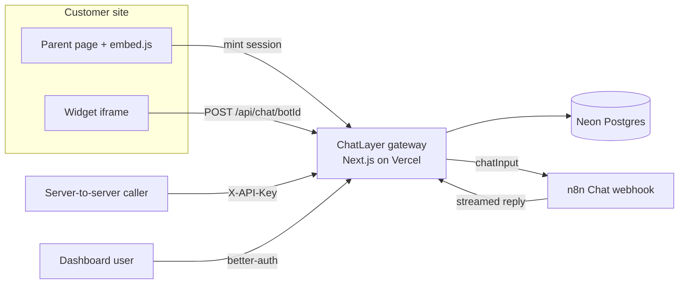
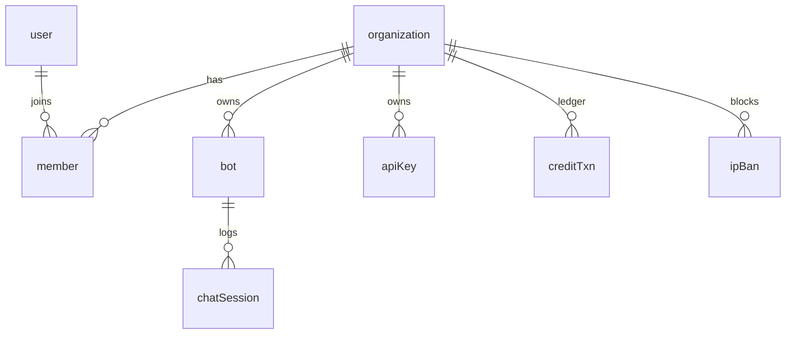

# ChatLayer — How It Works

ChatLayer is a secure, branded chat frontend and gateway for **n8n Chat** workflows.
n8n lets you build AI assistants; ChatLayer is the layer that sits between your
visitors and n8n so you can expose those assistants to real users without leaking
your webhook, getting hammered by abuse, or building auth, rate limiting, and analytics
yourself.

The core idea in one line: **the browser never talks to n8n directly. It talks to
ChatLayer, which authenticates, rate-limits, and meters every message before
forwarding it to your n8n webhook.**

---

## Tech stack

| Layer | Choice |
|---|---|
| Framework | Next.js 16 (App Router, React 19, server components) |
| Auth | better-auth (email/password + Google OAuth, organization plugin) |
| Database | Postgres (Neon) via Drizzle ORM + postgres.js |
| Validation | Zod |
| Styling | Tailwind v4 (BMW M theme: black canvas, M-blue accent, sharp corners) |
| Hosting | Vercel (functions pinned to sin1, next to Neon in ap-southeast-1) |
| Markdown | marked + dompurify (sanitized) |
| UA parsing | ua-parser-js v1 (MIT) - browser/OS/device for analytics |

---

## Architecture overview



ChatLayer is a single Next.js app that plays three roles:

1. **The gateway** (`/api/chat/[botId]`, `/api/session/[botId]`) is the secure proxy
   in front of each bot n8n webhook.
2. **The widget** (`/widget/[botId]`, `public/embed.js`) is the embeddable chat UI
   customers drop onto their sites.
3. **The dashboard** (`/dashboard`, `/bots`, `/settings`, ...) is where you manage
   bots, view analytics, handle billing, teams, and API keys.

---

## The request lifecycle (how a chat message flows)

This is the heart of the system. When a visitor sends a message:

```mermaid
sequenceDiagram
  participant P as Parent page (embed.js)
  participant W as Widget iframe
  participant G as /api/chat/[botId]
  participant D as Neon DB
  participant N as n8n webhook

  P->>G: POST /api/session/[botId]  (real Origin sent)
  Note over G: Origin checked vs the bot allowlist
  G-->>P: HMAC session token (bound to this bot)
  P->>W: load /widget/[botId]#t=token
  W->>G: POST /api/chat/[botId] { message } + Bearer token
  Note over G: reject banned IPs, identify caller, rate limit, credits, SSRF
  G->>N: POST { action, sessionId, chatInput }
  N-->>G: streamed reply (NDJSON / SSE / single JSON)
  G-->>W: streamed text/plain deltas (rendered as markdown)
  G->>D: upsert the session (ip, geo, parsed UA); no message text
```

Step by step, inside `app/api/chat/[botId]/route.ts`:

1. **Load the bot** from Postgres by id (404 if missing), then **reject banned IPs**: org-scoped IP bans are checked first, returning `403 ip_banned` before any work is done (`lib/ipbans.ts`).
2. **Identify the caller** (the caller-identity ladder, most-trusted first):
   - **API key** (`X-API-Key`, server-to-server), validated in `lib/apikeys.ts`,
     must belong to the bot org.
   - **Signed-in org member** via the better-auth cookie session; must be a member of
     the bot organization. This is what gates **private** bots.
   - **Anonymous token**, the HMAC token from `/api/session/[botId]`, accepted only
     for **public** bots and only if bound to this bot id.
3. **Rate limit** with token buckets per session and per IP, tuned per bot
   (`lib/ratelimit.ts`). The client IP is resolved with `TRUST_PROXY_HOPS` so a
   spoofed `X-Forwarded-For` cannot dodge it (`lib/config.ts`).
4. **Meter a credit** with `consumeCredit()`, which atomically decrements the org
   balance; `402 out_of_credits` if empty (`lib/credits.ts`).
5. **SSRF guard**: the bot `webhookUrl` is resolved and rejected if it points at
   loopback / private / link-local / metadata addresses (`lib/ssrf.ts`).
6. **Forward to n8n**: POST `{ action, sessionId, chatInput, files? }` to the bot
   webhook, attaching the bot optional header-auth credential. Redirects are not
   followed.
7. **Stream the reply back**: the upstream response is parsed line-by-line
   (`lib/stream.ts` handles NDJSON token chunks, SSE data frames, or a single JSON
   body) and streamed to the browser as `text/plain` deltas, which the widget renders
   as sanitized markdown.
8. **Record the session**: `recordSession()` (`lib/store.ts`) upserts one row per
   session with the ip, geo country (Vercel `x-vercel-ip-country`), and the
   browser/OS/device parsed from the user agent (ua-parser-js), bumping a message
   counter. **Still no message text** -- only session metadata for analytics and
   security. ChatLayer is a secure UI + router for n8n, not a chat archive.

The **embed loader** (`public/embed.js`) is what makes the origin check meaningful:
it runs in the *parent* page, calls `/api/session/[botId]` from there (so the browser
sends the real parent Origin, which ChatLayer checks against the bot domain
allowlist), then hands the resulting token to the iframe via the URL hash.

---

## Authentication & sessions

Two independent auth systems for two different audiences:

- **Dashboard users** use **better-auth** (`lib/auth.ts`): email/password + Google
  OAuth, with the **organization plugin** for teams. Sessions are cookie-based.
  `requireContext()` (`lib/server-auth.ts`) resolves the signed-in user and their
  active org on every dashboard page, creating a personal workspace on first login.
- **Chat visitors** use short **HMAC-signed session tokens** (`lib/token.ts`) issued
  by `/api/session/[botId]`. Each token is bound to a single bot and expires in 24h.
  They carry no personal data; they exist only to gate and rate-limit anonymous chat
  on public bots.

Server-to-server callers use **org-scoped API keys** (`sk_...`, sha256-hashed at
rest, `lib/apikeys.ts`) sent as `X-API-Key`.

---

## Multi-tenancy

Everything is scoped to an **organization**:

- A user belongs to an org via a `member` row (with a role). `requireContext()`
  returns the active org for every request.
- **Bots, usage events, API keys, credits, and members** are all
  org-scoped. Dashboard reads and every server action (`app/(dash)/actions.ts`) check
  org ownership before touching a row.
- **Private bots** are reachable only by members of the owning org, enforced in the
  chat route by looking up membership, and in the widget page by 404-ing non-members.

---

## Security model

Defense in depth, layer by layer:

| Layer | What it does | Where |
|---|---|---|
| Hidden webhook | The n8n URL is a DB field, never sent to the browser | `bot.webhookUrl` |
| Signed sessions | HMAC-SHA256 tokens, bound to a bot, expiring | `lib/token.ts` |
| Rate limiting | Token bucket per session + per IP, per bot | `lib/ratelimit.ts` |
| Spoof-resistant IP | Reads the trusted hop of `X-Forwarded-For` | `lib/config.ts` (`TRUST_PROXY_HOPS`) |
| Origin allowlist + CORS | Per-bot domains; blocks cross-site browser abuse | `lib/config.ts` |
| SSRF protection | Blocks internal/metadata webhook targets | `lib/ssrf.ts` |
| Frame control | `/widget/*` is frameable; everything else `X-Frame-Options: DENY` | `next.config.ts` |
| Tenant isolation | Org checks on every read + server action | `app/(dash)/actions.ts`, routes |
| Input validation | 4000-char message cap; Zod on all server actions | routes, actions |
| Credit metering | 1 credit per message; 402 when drained | `lib/credits.ts` |
| No message storage | Chat text is never persisted; only session metadata (ip, geo, UA) | `lib/store.ts` |
| IP ban | Org-scoped IP blocklist, rejected at the gateway before any work | `lib/ipbans.ts` |

Two independent adversarial reviews were run during development; the confirmed
findings (a cross-tenant private-bot bypass, an SSRF hole, an invite
privilege-escalation, an X-Forwarded-For rate-limit bypass, and a few correctness
bugs) were all fixed.

---

## Data model



- **better-auth tables**: `user`, `session`, `account`, `verification`.
- **org plugin**: `organization` (white-label fields + `credits`), `member`,
  `invitation`.
- **app tables**: `bot` (webhook, branding, limits, widget options), `chatSession`
  (one row per session -- ip, geo country, parsed browser/os/device, message
  counter; **no message text**), `ipBan` (org-scoped IP blocklist), `apiKey`,
  `creditTxn` (credit ledger).

Schema lives in `lib/db/schema.ts`; the client (postgres.js, `prepare:false` for the
Neon pooler) in `lib/db/index.ts`. Push it with `npm run db:push`.

---

## Features

- **Streaming**: replies stream word-by-word from n8n through the gateway to the
  widget (`text/plain` deltas), falling back to single delivery for non-streaming
  workflows.
- **Markdown rendering**: bot replies render markdown (bold, lists, code, links),
  XSS-sanitized with DOMPurify (`components/Chat.tsx`).
- **File upload**: per-bot type/size limits; the file is base64-forwarded to n8n.
- **Widget customization**: per-bot name, color, logo, welcome, suggested prompts,
  RTL, consent screen, custom CSS.
- **Public vs private bots**: anonymous visitors vs org-member-only.
- **Billing**: message credits (1 credit = 1 message), a packages page, and a ledger.
  Stripe-ready (`STRIPE_SECRET_KEY`); dev top-up otherwise.
- **Analytics (metadata only)**: session/message counts, a 14-day chart, per-bot, and top browsers/countries (`lib/analytics.ts`), plus a recent-sessions table -- all from session metadata, never chat text.
- **IP ban**: org-scoped IP blocklist (`lib/ipbans.ts`), managed on the Security page or straight from the analytics session list, enforced at the gateway.
- **MCP server**: `/api/mcp` exposes list_bots, create_bot, update_bot, and
  get_analytics to Claude/Cursor, authenticated by an org API key.
- **White-label**: brand name, hide the "Protected by ChatLayer" footer, custom
  domain field.
- **Theme**: light/dark toggle; dark is the BMW-M near-black look.

---

## Project structure

```
app/
  page.tsx                     landing page (marketing + live demo)
  (auth)/login, signup         auth pages
  (dash)/                      dashboard (layout guards via requireContext)
    dashboard, analytics, bots, billing, security, docs, settings
    actions.ts                 server actions (all org-scoped, Zod-validated)
  widget/[botId]/              the embeddable chat page (iframe target)
  api/
    chat/[botId]/route.ts      the secure chat gateway (the core)
    session/[botId]/route.ts   issues anonymous chat tokens
    auth/[...all]/route.ts     better-auth handler
    mcp/route.ts               MCP JSON-RPC server
components/
  Chat.tsx                     the widget UI (streaming, markdown, file upload)
  dash/                        dashboard components (Sidebar, BotForm, ApiKeys, ...)
lib/
  db/schema.ts, db/index.ts    Drizzle schema + Postgres client
  auth.ts, auth-client.ts      better-auth server + client
  server-auth.ts               requireContext (cached, org resolution)
  bots.ts, apikeys.ts          bot CRUD + API key management
  config.ts, token.ts          origin/IP/CORS helpers + HMAC chat tokens
  ratelimit.ts, ssrf.ts        rate limiting + SSRF guard
  store.ts                     session recording (metadata only, no message text)
  ipbans.ts                    org-scoped IP ban list + gateway check
  analytics.ts, credits.ts     stats + billing
  stream.ts                    upstream reply parser
public/embed.js                the one-tag embed loader
scripts/seed.ts                seeds the demo org + bot
```

---

## Deployment (Vercel + Neon)

1. **Database**: a Neon Postgres project. Copy the **pooled** connection string (host
   contains `-pooler`).
2. **Repo**: connected to Vercel; every push to `main` auto-deploys.
3. **Environment variables** (Vercel, Settings, Environment Variables):

   | Variable | Purpose |
   |---|---|
   | `DATABASE_URL` | Neon pooled connection string |
   | `BETTER_AUTH_SECRET` | 32+ char secret that signs auth sessions |
   | `BETTER_AUTH_URL` | the production URL, e.g. `https://chatlayer.vercel.app` |
   | `TRUST_PROXY_HOPS` | `1` (Vercel sits behind a proxy) |
   | `GOOGLE_CLIENT_ID` / `GOOGLE_CLIENT_SECRET` | for Google login |

   Do **not** set `ALLOW_PRIVATE_WEBHOOKS` in production (leaving it off keeps SSRF
   protection on). `NODE_ENV` is set by Vercel automatically.
4. **Schema**: run `npm run db:push` (with the Neon `DATABASE_URL`) to create the
   tables; `npm run seed` for the demo bot.
5. **Region**: `vercel.json` pins functions to sin1 (Singapore) to sit next to Neon
   in ap-southeast-1. Same-region queries are the difference between snappy and
   multi-second navigation. On Hobby, confirm the region in Settings, Functions if
   needed.
6. **Google redirect URI**: add `https://<your-domain>/api/auth/callback/google` to
   your OAuth client.

---

## Local development

```bash
cp .env.example .env.local          # fill DATABASE_URL, BETTER_AUTH_SECRET
npm install
npm run db:push                     # create tables in your Postgres
npm run seed                        # optional demo bot
npm run dev                         # http://localhost:3000
npm run check                       # runs the unit self-checks
```

Local dev needs a Postgres connection (a Neon branch or a local Postgres). If you
point `DATABASE_URL` at a far-away Neon region, local queries round-trip to that
region and feel slow; that is independent of the deployed speed.

---

## Extending it

- **New dashboard page**: add a route under `app/(dash)/`; call `requireContext()`
  for the org, and scope all queries by `orgId`.
- **New bot option**: add a column in `lib/db/schema.ts`, a field in
  `components/dash/BotForm.tsx`, wire it in `app/(dash)/actions.ts`, and surface it in
  `components/Chat.tsx` if it affects the widget. Re-run `db:push`.
- **New MCP tool**: add it to the tool list + callTool switch in
  `app/api/mcp/route.ts`.
- **Real payments**: set `STRIPE_SECRET_KEY` and implement Checkout in the purchase
  action (`purchaseCreditsAction`).

For a schema change with real data, prefer generated migrations over
`drizzle-kit push --force`; the force flag can rebuild a table and drop rows.